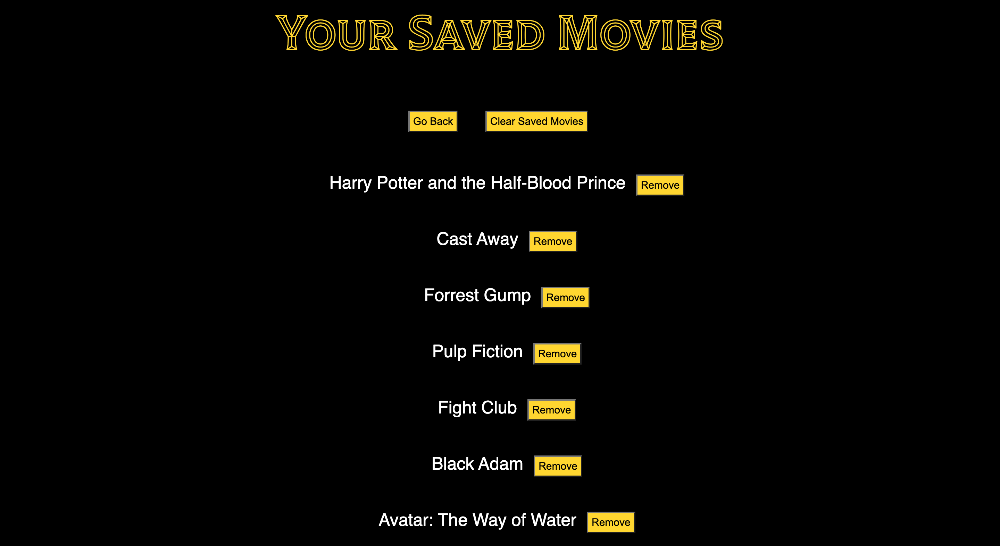

# Popcorn Portal

https://juliaghany.github.io/Popcorn-Portal/

## Description

Our motivation for this project was to create an application that assists a user in finding a movie they would like to watch by providing them with details about a movie they search up to inform their decision. The application will present the user with basic information on a searched movie such as the title, a movie poster, a general description, featured actors, and the director's name. Additionally, the application will also have the functionality to suggest similar movies to the user based on their search, provide direct links to streaming platforms where the movie can be watched, and the option to save a movie to a "Saved Movies" list. 

We built this application out with the goal of practicing writing code from scratch using HTML, JavaScript, and CSS. In addition to that, we also wanted to practice using multiple third-party and server-side APIs, all while using GitHub to store our code and deploy our application. 

This application offers a quick and easy way of finding information on a searched movie while using features like suggesting similar movies, providing streaming platforms where the movie can be watched, and even allowing a user to save movies to a "Saved Movies" list, all to enhance their experience of finding and deciding on a movie to watch for movie night.

Through working on this project and building out this application, we were able to fine tune our collaboration skills, while using tools such as GitHub, third-party APIs, and server-side APIs, to create a responsive and user friendly application.

## Usage

To use this application, you will first go to the deployed page here: 'link to deployed application'

From there, you will enter the name of a movie you're interest in watching or learning more about into the search bar, once you click the "Search" button or hit enter, you will be presented with a list of movies that match your search below the search bar. 

When you click on your desired movie from the list of search results, the application will present you with details on the movie such as a title, movie poster, movie description, featured actors, and the director name. 

If you scroll down, you'll see logo images of streaming platforms below your selected movie. Clicking on these streaming platofrm logos will take you directly to the platform where you can stream your desired movie. 

Right beneath the movie poster, you'll see a "Save For Later" button. Clicking on this button will save your movie to a list of your saved movies. 

If you scroll down to the bottom of the page, you'll see a 'Recommended Movies' section, which recommends movies based on your search result. 

At the top of the deployed application, right below the header, you can click on "Your Saved Movies". 

Clicking on "Your Saved Movies" will take you to a page of all the movies you've saved. 

On the right of each saved movie title, you'll see a "Remove" button, clicking on this button will remove this movie from your saved movie list. 

Below the header of the 'Your Saved Movies' page, you'll see a "Clear Saved Movies" button, clicking this button clears all your saved movies. 

To the left of the "Clear Saved Movies" button, you'll see a "Go Back" button, clicking on the button will allow you to go pack to the homepga e of the deployed application. 

## Credits

Julia Hany: https://github.com/juliaghany 

Zach Berger: https://github.com/berman619 

Nastacia Shershova: https://github.com/snastacia 

Request URLs were fetched from the following APIs:
https://developers.themoviedb.org/3/movies/get-movie-credits
https://developers.themoviedb.org/3/getting-started/search-and-query-for-details
https://developers.themoviedb.org/3/movies/get-movie-recommendations 
https://rapidapi.com/utelly/api/utelly 

Enrique helped us figure out how to use data attributes to store the movie ID in the search result buttons so that we could pass that data to additional API calls to TMDB. 

Andrew, the substitute TA, helped us figure out how to load local storage onto the "Your Saved Movies" page. 

We referenced this website to find the director's name for each movie using the find() method: https://developer.mozilla.org/en-US/docs/Web/JavaScript/Reference/Global_Objects/Array/find

## License

N/A

## Features

Search engine that fetches the results of movie titles. 

Save button that saves a list of movies to your local storage and then displays them in a separate page. 

Functionality to recommend movies based on your search. 

Linked streaming platforms for each selected search result, which when clicked on takes you directly to the platform where your desired movie is streaming. 
